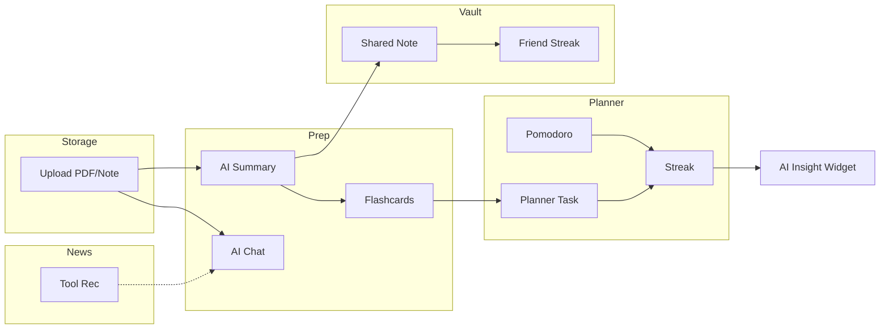

# Neuron — Futuristic AI Student Operating System
## Hackathon Blueprint v1.0

> **Positioning:** *The operating system for how students learn, plan, store, and collaborate — one immersive AI-native workspace.*

---

## 1. Executive Summary

**Neuron** is a workflow-connected student OS that unifies storage, AI preparation, planning, news intelligence, and social study vaults into a single cinematic interface. For a 24-hour hackathon, ship **one hero workflow** end-to-end with mock AI everywhere else — judges remember *feel* and *story*, not CRUD completeness.

**North star demo (60 seconds):**
1. Land on cinematic dashboard → floating widgets pulse
2. Upload PDF to Smart Storage → AI summary appears
3. One-click → flashcards in Preparation Zone
4. Add revision task to Track & Planner → streak ticks up
5. Share note to Study Vault → friend streak animates

---

## 2. Startup Positioning

| Dimension | Neuron |
|-----------|--------|
| **Category** | AI Student OS / Learning Workspace |
| **One-liner** | *Linear meets Perplexity for your entire student life.* |
| **ICP** | University students (18–24), exam-heavy, multi-subject |
| **Pain** | Fragmented tools: Drive + Notion + ChatGPT + calendar + Quizlet |
| **Moat (vision)** | Workflow graph — every artifact connects; AI knows your syllabus context |
| **Comparable** | Aura (ambient AI), Arc (spatial UI), Linear (craft), Perplexity (answers) |

**Elevator pitch (judges):**
> "Students juggle 6+ apps. Neuron is one immersive OS where every upload becomes summaries, flashcards, planner tasks, and shared vault assets — connected by AI workflows, not folders."

---

## 3. Feature Architecture

```
┌─────────────────────────────────────────────────────────────────────────┐
│                         NEURON — STUDENT OS                              │
├─────────────────────────────────────────────────────────────────────────┤
│  SHELL LAYER                                                             │
│  • Global command bar (⌘K)  • AI copilot sidebar  • Notification orb    │
│  • Context rail (module nav)  • Ambient background  • Session streak    │
├──────────────┬──────────────┬──────────────┬──────────────┬──────────────┤
│ Smart        │ Preparation  │ Track &      │ News &       │ Study        │
│ Storage      │ Zone         │ Planner      │ Updates      │ Vault        │
├──────────────┴──────────────┴──────────────┴──────────────┴──────────────┤
│ WORKFLOW ENGINE (MVP: client-side event bus + mock orchestration)         │
│ upload → summarize → flashcard → task → vault → insight                   │
├─────────────────────────────────────────────────────────────────────────┤
│ DATA: Supabase (auth, files metadata, notes, tasks, streaks)             │
│ AI: OpenAI / Gemini API (summarize, chat, cards) — mock fallback          │
└─────────────────────────────────────────────────────────────────────────┘
```

### Module specs (MVP depth)

| Module | Core entities | MVP features | Defer |
|--------|---------------|--------------|-------|
| **Smart Storage** | File, Note, Link, Tag | Upload UI, grid view, type filters, mock PDF preview | Real OCR, full-text search |
| **Preparation Zone** | Chat, Summary, Flashcard deck, Study mode | AI chat (mock/API), summary from storage item, 5-card deck gen | Spaced repetition algo |
| **Track & Planner** | Task, Goal, Pomodoro session, Streak | Week timetable UI, task CRUD, pomodoro timer, streak counter | Calendar sync |
| **News & Updates** | Feed item, Tool card | Curated static feed + 2 "AI tool" cards | Live RSS, internships API |
| **Study Vault** | Shared note, Friend, Leaderboard | Share mock note, friend list, streak compare | Real-time collab |
| **Profile** | User, prefs, stats | Avatar, stats from mock aggregator, theme | Billing |

---

## 4. Workflow Relationships (Interconnection Map)



**Workflow events (implement as `neuronBus.emit`)**

| Event | Triggers | UI feedback |
|-------|----------|-------------|
| `resource.uploaded` | File lands in Storage | Toast + "Summarize?" CTA |
| `ai.summary.ready` | Summary complete | Badge on Prep Zone nav |
| `flashcards.generated` | From summary | Card stack preview modal |
| `task.created` | From flashcards | Planner dot highlight |
| `vault.shared` | Note shared | Vault pulse + streak +1 |
| `pomodoro.complete` | Timer ends | Streak widget animate |
| `insight.generated` | End of session | Dashboard insight card |

---

## 5. Page-by-Page Breakdown

### 5.1 Landing + Login
- **Reuse:** Existing EduAI homepage → rebrand to **Neuron**
- **Add:** Product OS screenshot, workflow strip, "Enter Neuron" CTA
- **Auth:** Supabase email/password (already integrated)

### 5.2 Dashboard (Command Center)
**Layout:** Bento grid + floating widgets

| Widget | Content | Size |
|--------|---------|------|
| **Focus today** | Next task + AI suggestion | 2×1 |
| **Streak orb** | Days + flame animation | 1×1 |
| **Quick capture** | Upload / note / link | 1×1 |
| **Prep pulse** | Last summary + "Continue" | 2×1 |
| **Workflow trail** | Last 3 connected actions | full width |
| **AI insight** | "You studied trees 2h — review graphs" | 1×1 |
| **Vault activity** | Friend streak mini | 1×1 |

**Nav rail (left):** Icon-only modules + active glow

### 5.3 Smart Storage
- **Header:** Search + filter chips (PDF, Notes, Assignments, Links)
- **Body:** Masonry/grid cards with glass thumbnails
- **Actions:** Upload dropzone, "Send to Prep" on each card
- **Empty state:** Cinematic illustration + upload CTA

### 5.4 Preparation Zone
- **Tabs:** Chat | Summaries | Flashcards | Study Mode
- **Chat:** Perplexity-style thread + source chips from storage
- **Summaries:** Side panel list ← linked storage items
- **Flashcards:** 3D flip stack + "Add to Planner"
- **Study Mode:** Focus timer overlay + minimal UI

### 5.5 Track & Planner
- **Views:** Week timetable | Goals | Pomodoro | Analytics
- **Timetable:** Drag blocks (static demo OK)
- **Goals:** Progress rings
- **Pomodoro:** Circular timer with neon ring
- **Analytics:** Bars + streak history (mock data)

### 5.6 News & Updates
- **Feed:** Card list (AI tools, tech, internships)
- **Filters:** Tools | News | Internships | Productivity
- **Action:** "Try in Prep" opens chat with prefilled context

### 5.7 Study Vault
- **Shared notes:** Grid with author avatars
- **Flashcard decks:** Shared badge
- **Friends:** Streak leaderboard
- **CTA:** Share from Prep/Storage

### 5.8 Profile
- Stats aggregation, study hours, modules used
- Settings: theme accent, notifications (UI only)
- Sign out

---

## 6. Dashboard Structure (ASCII)

```
┌──────────────────────────────────────────────────────────────────┐
│ ◉ Neuron          [ ⌘K Command ]     [ AI ● ]    [ @user ]        │
├────┬─────────────────────────────────────────────────────────────┤
│ 🧠 │  Good evening, Alex          🔥 12 day streak              │
│ 📁 │  ┌─────────────┬─────────────┬──────────┐                  │
│ ⚡ │  │ Focus Today │ Prep Pulse  │ Streak   │                  │
│ 📅 │  │             │             │   Orb    │                  │
│ 📰 │  └─────────────┴─────────────┴──────────┘                  │
│ 🏛 │  ┌────────────────────────────┬──────────┐                  │
│ 👤 │  │ Workflow Trail              │ AI Insight│                  │
│    │  │ upload→summary→cards→task │           │                  │
│    │  └────────────────────────────┴──────────┘                  │
└────┴─────────────────────────────────────────────────────────────┘
```

---

## 7. UI/UX Design System — "Neural Glass"

### 7.1 Design tokens

| Token | Value |
|-------|-------|
| **BG base** | `#030308` → `#0a0a12` |
| **Surface glass** | `rgba(255,255,255,0.04)` + blur 24px |
| **Neon primary** | Violet `#8B5CF6` → Indigo `#6366F1` |
| **Neon accent** | Cyan `#22D3EE` |
| **Glow** | `box-shadow: 0 0 60px -12px rgba(99,102,241,0.4)` |
| **Radius** | Cards 16–24px, buttons 12px |
| **Type** | Inter / Geist — headings `-0.02em` tracking |

### 7.2 Component library

- `GlassPanel` — base container
- `NeonButton` — gradient + ripple
- `FloatingWidget` — parallax hover
- `ModuleRail` — vertical nav
- `CommandPalette` — ⌘K overlay
- `WorkflowChip` — connected step pills
- `AIOrb` — pulsing copilot trigger
- `BentoCard` — dashboard tiles
- `DataCard` — storage items
- `FlipCard` — flashcards

### 7.3 UI inspirations

| Product | Borrow |
|---------|--------|
| **Linear** | Density, keyboard-first, subtle borders |
| **Perplexity** | Chat layout, source citations |
| **Arc** | Spatial sidebar, bold color accents |
| **Aura** | Ambient AI, soft gradients |
| **Apple Vision Pro** | Depth layers, floating panels, depth blur |
| **Raycast** | Command palette |

### 7.4 Animation playbook

| Interaction | Animation |
|-------------|-----------|
| Page transition | Fade + 8px Y, 300ms spring |
| Module switch | Rail icon glow + content crossfade |
| Card hover | Tilt 3D + neon border intensify |
| Upload | Progress ring + particle burst on complete |
| Workflow step | Chip slides in, connecting line draws |
| Streak +1 | Orb scale pulse + confetti micro |
| Pomodoro | SVG ring `stroke-dashoffset` |
| Command palette | Scale 0.96→1 + backdrop blur |

**Framer Motion:** `layout`, `layoutId` for shared element transitions between Storage → Prep.

---

## 8. Tech Stack (Hackathon-realistic)

| Layer | Choice | Why |
|-------|--------|-----|
| **Frontend** | React 18 + Vite + TypeScript | Already in repo |
| **Styling** | Tailwind + CSS variables | Speed + consistency |
| **Motion** | Framer Motion | Already integrated |
| **Routing** | React Router v6 | 8 pages clean |
| **Auth** | Supabase Auth | Already wired |
| **DB** | Supabase Postgres | Auth + tables in one |
| **Storage** | Supabase Storage (or mock URLs) | PDF metadata |
| **AI** | OpenAI `gpt-4o-mini` OR Gemini Flash | Summaries/chat; **mock JSON fallback** |
| **State** | Zustand (light) | Workflow + UI state |
| **Icons** | Lucide React | Consistent stroke |

**Avoid for 24h:** Microservices, custom backend, WebSockets, mobile app.

---

## 9. Database Suggestions (Supabase)

```sql
-- profiles (extends auth.users)
profiles: id, display_name, avatar_url, streak_count, created_at

-- storage
resources: id, user_id, type enum, title, url, meta jsonb, created_at

-- preparation
summaries: id, resource_id, content text, created_at
flashcard_decks: id, summary_id, title
flashcards: id, deck_id, front, back
chat_sessions: id, user_id, messages jsonb

-- planner
tasks: id, user_id, title, due_at, source_type, source_id, done
pomodoro_sessions: id, user_id, duration, completed_at
goals: id, user_id, title, target, progress

-- vault
vault_items: id, owner_id, type, ref_id, visibility
friend_links: user_id, friend_id, friend_streak

-- news (MVP: seed data)
feed_items: id, category, title, summary, url, image_url
```

**RLS:** `user_id = auth.uid()` on all user tables; vault_items `visibility = 'public' OR owner_id = auth.uid()`.

---

## 10. Frontend Structure

```
src/
├── app/
│   ├── App.tsx                 # Router + auth gate
│   └── routes.tsx
├── pages/
│   ├── marketing/              # Landing (EduAI → Neuron rebrand)
│   ├── auth/
│   ├── dashboard/
│   ├── storage/
│   ├── preparation/
│   ├── planner/
│   ├── news/
│   ├── vault/
│   └── profile/
├── components/
│   ├── shell/                  # ModuleRail, CommandPalette, AIOrb
│   ├── ui/                     # GlassPanel, NeonButton, BentoCard
│   └── modules/                # Feature-specific widgets
├── lib/
│   ├── supabase.ts
│   ├── ai/                     # summarize(), chat(), mockAdapter
│   └── workflow/               # neuronBus, workflowRunner
├── stores/
│   └── useNeuronStore.ts       # streak, active workflow, notifications
├── hooks/
└── types/
```

---

## 11. AI Workflows (MVP)

| Workflow | Input | AI action | Output | Hackathon mode |
|----------|-------|-----------|--------|----------------|
| **Summarize** | PDF text (first 4k chars) | `summarize` prompt | Markdown summary | API or 2s mock |
| **Flashcards** | Summary | `generate 5 Q&A pairs JSON` | Deck | Parse JSON |
| **Chat** | Message + optional resource context | RAG-lite: prepend summary | Stream text | Mock if no key |
| **Insight** | Tasks + pomodoro + subjects | Weekly insight prompt | 1 sentence widget | Static templates |
| **News rec** | Feed category | None | Pre-seeded cards | Static |

**Prompt template (summary):**
```
You are Neuron, a student OS assistant. Summarize for exam revision:
- Key concepts (bullets)
- Definitions
- Likely exam questions
Source: {{extracted_text}}
```

**Env:**
```
VITE_OPENAI_API_KEY=...
VITE_USE_MOCK_AI=true   # flip off for live demo
```

---

## 12. 24-Hour Execution Roadmap

### Phase 0 — Foundation (2h)
- [ ] Rebrand EduAI → Neuron (logo, copy, colors)
- [ ] Add React Router + `AppShell` layout
- [ ] Module rail + placeholder pages

### Phase 1 — Dashboard + Storage (5h)
- [ ] Dashboard bento grid (mock data)
- [ ] Storage upload UI + local state / Supabase metadata
- [ ] `resource.uploaded` workflow event

### Phase 2 — Hero workflow (6h) ⭐ JUDGE PRIORITY
- [ ] Summary panel (mock → API)
- [ ] Flashcard generator + flip UI
- [ ] "Add to planner" task creation
- [ ] Workflow trail component on dashboard

### Phase 3 — Planner + Vault polish (4h)
- [ ] Pomodoro + streak widget
- [ ] Vault share UI + friend streak mock
- [ ] Planner week view (static)

### Phase 4 — Prep chat + News (3h)
- [ ] Chat UI (Perplexity style)
- [ ] News feed static cards

### Phase 5 — Polish + demo (4h)
- [ ] ⌘K command palette
- [ ] Page transitions, empty states
- [ ] Demo script rehearsal
- [ ] Deploy Vercel + env vars

---

## 13. MVP Prioritization (MoSCoW)

| Must ship | Should ship | Could ship | Won't ship (24h) |
|-----------|-------------|------------|------------------|
| Dashboard shell | Profile page | News internships live | Mobile app |
| Storage upload UI | Pomodoro timer | Real PDF parsing | Real-time collab |
| Summary → Flashcards → Task workflow | AI chat | Command palette | LMS integrations |
| Auth + 3 module pages navigable | Study vault share UI | Goals analytics | Blockchain / Web3 |
| Cinematic UI + animations | Streak system | | |

---

## 14. Hackathon Strategy

### Team roles (ideal 3–4)
- **UI/UX lead:** Shell, dashboard, motion system
- **Workflow dev:** Storage → Prep → Planner pipeline
- **AI/integrations:** API + mocks + Supabase schema
- **Pitch/demo:** Script, deck, video backup

### Judging angles to hit
1. **Problem clarity** — fragmented student toolchain
2. **Technical novelty** — workflow graph, not another chatbot
3. **Design excellence** — OS metaphor, cinematic polish
4. **Feasibility** — clear path to real AI + Supabase
5. **Demo** — one flawless 90s golden path

### Risk mitigation
- Record demo video before deadline
- `VITE_USE_MOCK_AI=true` default; live AI as bonus
- Seed dashboard with realistic names/data
- One laptop, offline-tolerant mocks

---

## 15. Judge Presentation Strategy (90s script)

| Time | Beat |
|------|------|
| 0–15s | Hook: "Students use 6 apps. Neuron is one OS." |
| 15–30s | Show dashboard — widgets, streak, workflow trail |
| 30–60s | **Golden path:** upload → summary → flashcards → planner task |
| 60–75s | Vault share + streak; mention interconnected design |
| 75–90s | Vision: syllabus-aware AI, university partnerships |

**Slide deck (5 slides):** Problem → Solution → Demo screenshot → Architecture → Roadmap

---

## 16. Scalable Future Vision

| Phase | Timeline | Features |
|-------|----------|----------|
| **MVP** | Hackathon | Mock AI, 5 modules, 1 workflow |
| **Alpha** | 4 weeks | Real PDF extract, OpenAI, Supabase RLS |
| **Beta** | 3 months | Spaced repetition, calendar sync, notifications |
| **V1** | 6 months | University LMS plugins, study groups, mobile PWA |
| **Platform** | 12 months | Neuron API, third-party modules, marketplace |

**Revenue (future):** Freemium — free tier limits AI calls; Pro $8/mo students; institutional licenses.

---

## 17. Migration from Current Repo (EduAI → Neuron)

| Existing asset | Neuron use |
|----------------|------------|
| Landing homepage | Rebrand + add OS preview |
| Supabase auth | Keep |
| Glass components | Extract to `components/ui` |
| Framer Motion patterns | Shell transitions |
| Dashboard stub | Replace with bento command center |

---

## 18. Key Metrics (post-hackathon)

- Activation: upload → summary within first session
- Workflow completion rate
- D7 streak retention (planner)
- Vault shares per user

---

*Document owner: Neuron product architecture — hackathon execution reference.*
